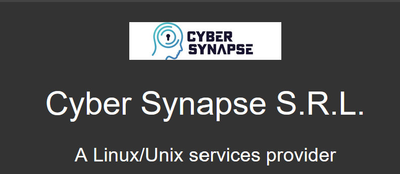

  

  

<h1 align="center">HARDN-XDR</h1>
 

  

    
  <code>HARDN-XDR</code>

  
  

 
 

    

## HARDN-XDR
- **Our Goal**:
  - Assist the open source community in building a Debian based **"GOLDEN IMAGE"** System, with Multi Architecture capabilities.
- **Our Purpose**:
  - To empower IT administrators and users with the tools they need to ensure endpoint security, optimize performance, and maintain compliance across their organization.
- **What we have to offer**:
  - A robust and secure endpoint management solution designed to simplify and enhance the management of devices in your network.
  - Advanced features for monitoring, securing, and maintaining endpoints efficiently.
  - `STIG` COMPLIANCE to align with the [Security Technical Information Guides](https://public.cyber.mil/stigs/) provided by the [DOD Cyber Exchange](https://public.cyber.mil/).

 
 

    

- **Comprehensive Monitoring**: Real-time insights into endpoint performance and activity.
- **Enhanced Security**: Protect endpoints with advanced security protocols.
- **Scalability**: Manage endpoints across small to large-scale networks.
- **User-Friendly Interface**: Intuitive design for seamless navigation and management.
- **Interactive Menu**: A user-friendly menu to select which hardening modules to apply.
- **STIG Compliance**: This release brings the utmost security for Debian Government based information systems.

 

 

<strong>Visit us at</strong> 
  <strong><a href="https://securityinternationalgroup.org/" style="font-size: 1.90em;">https://securityinternationalgroup.org/</a></strong> 

 

    

  
    
  

 

    
This project is licensed under the MIT License.

 

  <a href="https://hardn.cybersynapse.ro/">Visit HARDN-XDR Website</a>  

 

    
office@cybersynapse.ro

